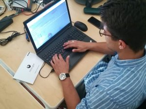

<a href='https://www.inthecyber.com/it/'>InTheCyber</a> is a company with the aim of increasing the real effectiveness of defense systems adopted by companies to protect their information assets and their strategic assets, so it boasts an excellent team both in the Offensive and in Defensive Security.

I spent a lot of time at ITC in close contact with the Offensive team, or even “RED”.
With them, I solved several challenges found on the net, but the real added value was being able to do it with the method that real Pentesters use.

The list of exercises I’ve done is as follow:

<table class="tg">
<thead>
  <tr>
    <th class="tg-c3ow"><a href='https://hackxor.net/'>Hackxor</a></th>
    <th class="tg-c3ow"><a href='http://www.dvwa.co.uk/'>DVWA</a></th>
    <th class="tg-c3ow"><a href='https://www.vulnhub.com/'>VulnHub</a></th>
    <th class="tg-c3ow"><a href='https://www.hackthebox.eu/'>HackTheBox</a></th>
  </tr>
</thead>
<tbody>
  <tr>
    <td class="tg-0pky">Balance Check</td>
    <td class="tg-0pky">SQL Injection (3 livelli)</td>
    <td class="tg-0pky">Kioptrix_level_1</td>
    <td class="tg-0pky">LaCasaDePapel</td>
  </tr>
  <tr>
    <td class="tg-0pky">Asset Management</td>
    <td class="tg-0pky">Code Injection (1 livello + revers shell)</td>
    <td class="tg-0pky">Mr. Robot</td>
    <td class="tg-0pky">WriteUp</td>
  </tr>
  <tr>
    <td class="tg-0pky">CTRL+Z</td>
    <td class="tg-0pky"></td>
    <td class="tg-0pky">Kioptrix_level_2</td>
    <td class="tg-0pky">Querier</td>
  </tr>
</tbody>
</table>
 

Exercise after exercise I was taught the basics of approaching an infrastructure to repent of, what to focus on, where to find useful resources, and much more.
It was fortunate to have done this period after the conclusion of “CyberChallenge”, so as to be able to refine all the info that “CyberChallenge” has left in my mind in a somewhat dispersed and sometimes unclear way.

From this experience I take home various ideas and suggestions that I will be able to improve and expand over time, one of them all, to enter the world of the Bug Bounty, an activity that if done well leads to the great growth of skills regarding web security.

I, therefore, thank all the guys who have followed and welcomed me for these two weeks and in particular Paolo Lezzi for giving me this opportunity.
